# Top 26 Email Marketing & Automation Platforms in 2025 (Comprehensive Review)

Ever spent hours building an email campaign only to realize your platform can't actually segment based on customer behavior, or worse, charges you extra for automation workflows that should be standard? Email marketing platforms solve the chaos of scattered tools by consolidating campaign creation, automation sequences, CRM functionality, and analytics into single dashboards—letting you nurture leads and close sales without juggling five subscriptions or learning complex code.

## [ActiveCampaign](https://activecampaign.com)

A sophisticated marketing automation platform combining email marketing, CRM pipelines, sales engagement tools, and machine learning for businesses prioritizing advanced automation workflows.

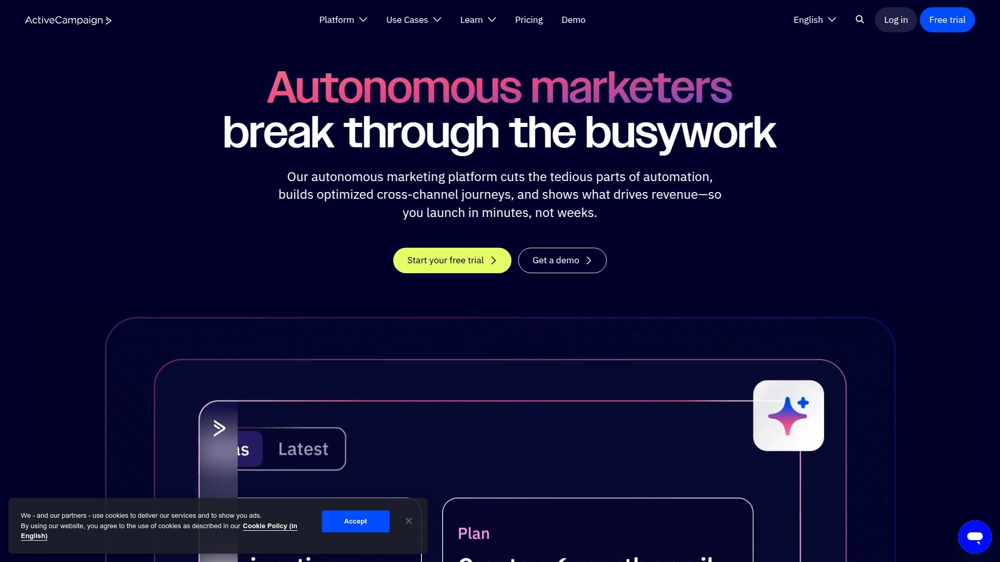

ActiveCampaign dominates the automation space through its visual workflow builder that handles complex, multi-step customer journeys. The platform excels when you need if/then logic, goal tracking within automations, and behavior-triggered sequences that respond to website visits, email opens, link clicks, and custom events. This sophistication makes it powerful for businesses running consultative sales processes or nurturing leads through longer consideration cycles.

**Marketing automation capabilities** include pre-built templates for welcome series, abandoned cart recovery, lead scoring, and win-back campaigns. Machine learning features on Professional and Enterprise plans optimize send times based on individual recipient behavior and predict which contacts are most likely to convert. Attribution reporting tracks which touchpoints drive conversions.

**Integrated CRM functionality** provides basic contact management on all plans, with visual sales pipelines available as paid add-ons starting at $49 monthly. Deal tracking, task management, and account-level organization help sales teams manage opportunities. Sales Engagement add-on at additional cost includes automated one-on-one emails, win probability scoring, and rep-specific reporting.

Email builder supports drag-and-drop creation with 250+ templates. Dynamic content personalizes messages based on contact data. A/B testing optimizes subject lines and content. Deliverability features include spam testing and automatic list cleaning.

Pricing starts at $15 monthly for Lite plan covering 500 contacts, including unlimited email sends, marketing automation, and basic CRM. Plus plan at $70 monthly adds landing pages, Facebook Custom Audiences, lead scoring, and SMS capabilities. Professional at $159 monthly includes machine learning, attribution, and predictive sending. Enterprise requires custom quotes. Costs scale significantly with contact count—10,000 contacts run $239 monthly on Plus plan.

Integration marketplace connects to 900+ tools including Shopify, WordPress, Salesforce, and Zapier. Free 14-day trial tests full functionality. Migration services help transfer data from previous platforms.

## [Mailchimp](https://mailchimp.com)

The most recognized email marketing brand offering user-friendly campaign creation, basic automation, and extensive integration ecosystem for small businesses.

Mailchimp built its reputation on simplicity, making it accessible for marketing beginners. The drag-and-drop email builder requires zero coding knowledge. Pre-designed templates provide starting points across industries. Campaign creation from concept to send typically completes faster than competitors.

**Free plan** provides genuine value with 500 contacts, 1,000 monthly email sends, and basic templates. This generosity makes Mailchimp popular for testing email marketing viability. However, free tier excludes automation, A/B testing, and advanced segmentation.

Automation capabilities remain basic compared to dedicated platforms. Pre-built customer journey templates handle welcome emails, abandoned carts, and purchase follow-ups. Custom automation builder allows simple workflows though lacking ActiveCampaign's sophistication. Behavioral targeting triggers messages based on contact activity.

Marketing CRM functionality tracks customer data and purchase history. Audience segmentation creates targeted lists. Basic reporting shows open rates, click rates, and revenue. Paid plans add comparative reports and multivariate testing.

Pricing jumps significantly beyond free tier. Essentials starts $13 monthly for 500 contacts, removing Mailchimp branding and adding basic automation. Standard at $20 monthly includes better segmentation and content optimization. Premium at $350 monthly adds advanced features. Transaction fees eliminated across all tiers.

Integrations exceed 300 including Shopify, WooCommerce, Salesforce, and QuickBooks. Website builder and landing pages included on paid plans. Best for businesses prioritizing ease over automation complexity.

## [HubSpot](https://www.hubspot.com)

A comprehensive marketing, sales, and service platform offering free CRM with email marketing, scaling to enterprise-grade automation and analytics.

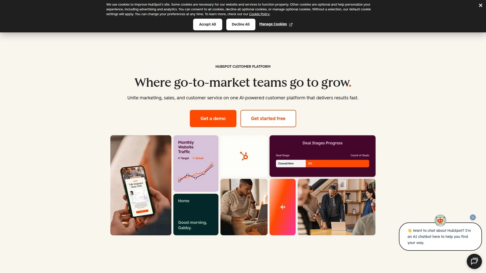

HubSpot differentiates through its genuinely free CRM providing unlimited contacts, deals, tasks, and basic email. This foundation grows into complete business operating system as needs expand. The unified platform eliminates data silos between marketing, sales, and customer service.

**Free tools** include contact management, email marketing (limited sends), forms, live chat, and meeting scheduler. Two thousand monthly email sends support small operations. Basic automation workflows trigger simple sequences. This generosity makes HubSpot attractive for bootstrapped startups.

Marketing Hub paid tiers unlock sophisticated capabilities. Starter at $20 monthly removes HubSpot branding and increases email limits. Professional adds advanced automation, A/B testing, attribution reporting, and social media tools. Enterprise includes predictive lead scoring and custom reporting.

Email builder provides drag-and-drop creation with personalization tokens. Smart content displays different sections to segmented audiences. Landing page builder generates conversion-optimized pages. Blog hosting and SEO recommendations drive organic traffic.

CRM integration means marketing actions sync automatically with contact records. Lead scoring identifies sales-ready prospects. Pipeline management tracks deals. Service Hub adds ticketing and knowledge base.

Learning curve steeper than simpler platforms but documentation is extensive. Best for companies wanting unified platform rather than stitching tools together.

## [Kit (formerly ConvertKit)](https://kit.com)

A creator-focused platform emphasizing subscriber growth, visual automation builders, and landing pages designed specifically for bloggers and content creators.

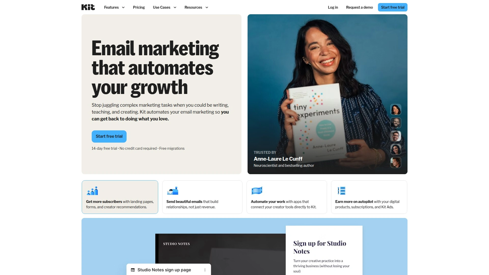

Kit tailors every feature toward creators monetizing audiences through courses, digital products, and memberships. The platform understands creator business models, providing tools matching their specific workflows.

**Visual automation builder** creates sequences through simple flowcharts. Subscribers move between paths based on actions—clicking links, purchasing products, or completing forms. Rule-based segmentation ensures relevant messaging. Tagging system organizes subscribers by interests and behaviors.

Landing page builder generates lead capture pages without coding. Templates suit various creator needs—ebook downloads, webinar signups, product launches. Customization maintains brand consistency. Forms embed on existing websites.

Email templates keep designs simple and readable, prioritizing content over flashy graphics. This philosophy aligns with creator audiences preferring authentic communication. Broadcast emails reach entire lists or segments.

Commerce integration sells digital products directly through Kit. Payment processing handles transactions. Automated delivery emails send download links post-purchase. Revenue reporting tracks sales performance.

Free plan covers 300 subscribers with unlimited landing pages and forms. Paid plans start $39 monthly for 300 subscribers, adding automation and integrations. Pricing scales with audience size. Premium support available at higher tiers.

Migration services transfer subscribers from other platforms. Best for solopreneurs and creators building email-based businesses.

## [MailerLite](https://www.mailerlite.com)

An affordable, intuitive platform combining email marketing, automation, landing pages, and website builders with generous free tier and clean interface.

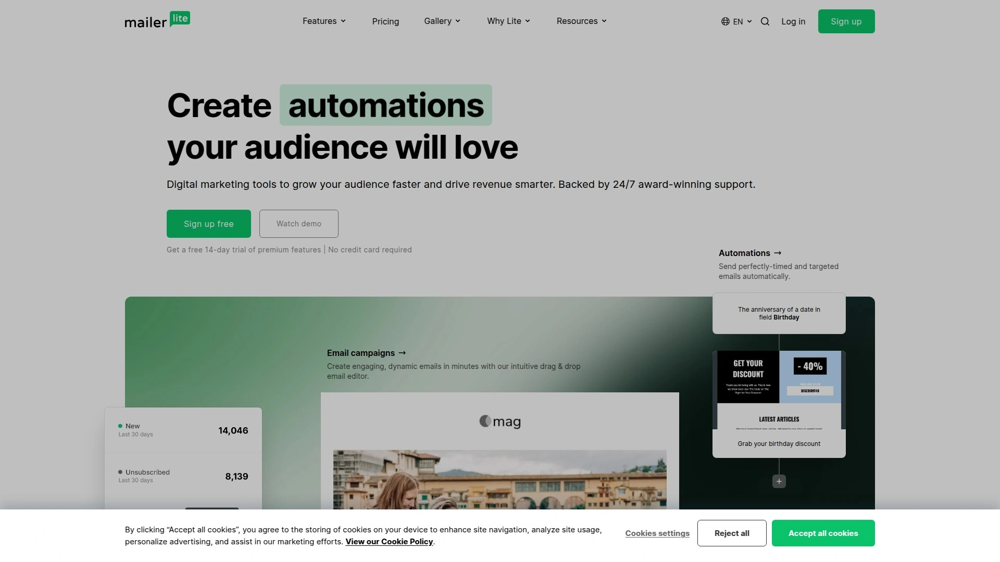

MailerLite delivers professional functionality at budget-friendly prices. The platform focuses on core email marketing without overwhelming users with enterprise features they won't use.

**Free plan generosity** includes 1,000 subscribers and 12,000 monthly emails—among the most generous free tiers available. No feature restrictions beyond send limits. This accessibility helps beginners start email marketing without financial barriers.

Email editor uses intuitive drag-and-drop with 90+ templates. Rich text editing provides precise control. Photo editor built into platform eliminates need for external design tools. Dynamic content personalizes messages.

Automation features surprise given the price point. Workflow builder creates sequences with triggers, conditions, and actions. Pre-built templates handle welcome series, abandoned carts, and re-engagement. Advanced segmentation targets specific subscriber groups.

Landing page and website builders generate conversion-focused pages. Templates speed creation. Forms capture leads across channels. Pop-ups grow lists through website visitors.

Paid plans starting $9 monthly add unlimited emails and priority support. No transaction fees at any tier. Deliverability rates competitive with expensive alternatives.

Simplicity makes MailerLite perfect for small businesses wanting results without complexity. Integration marketplace connects essential tools. Best value for budget-conscious marketers.

## [Brevo (Sendinblue)](https://www.brevo.com)

A multi-channel marketing platform offering email, SMS, WhatsApp, and chat with pricing based on sends rather than contacts.

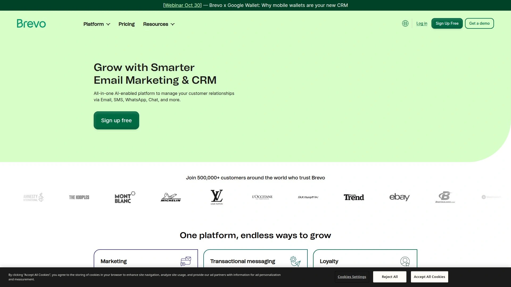

Brevo differentiates through contact-unlimited pricing, charging only for emails sent rather than list size. This model benefits businesses with large but infrequently-emailed lists. Growing subscriber counts don't automatically increase costs.

**Free plan** includes unlimited contacts with 300 daily email sends. Basic automation workflows function at no cost. SMS capabilities test multi-channel marketing. Live chat widget adds website engagement. This generosity supports genuine business operations.

Email builder provides drag-and-drop simplicity with responsive templates. Personalization inserts contact data. A/B testing optimizes performance. Send time optimization delivers at optimal moments.

Marketing automation creates sophisticated workflows on all plans. Visual builder chains actions based on triggers and conditions. Behavioral targeting responds to contact interactions. Abandoned cart recovery drives ecommerce revenue.

Transactional email API sends order confirmations, password resets, and notifications. Reliable deliverability for critical messages. SMTP relay available.

Sales CRM included free manages deals and pipelines. Contact scoring prioritizes hot leads. Task management keeps reps organized.

Starter plan at $25 monthly sends 20,000 emails without daily limits. Business tier adds advanced automation and multi-user access. Best for businesses with large, less-engaged lists.

## [GetResponse](https://www.getresponse.com)

An all-in-one platform combining email marketing, automation, webinar hosting, and landing pages for businesses running comprehensive digital campaigns.

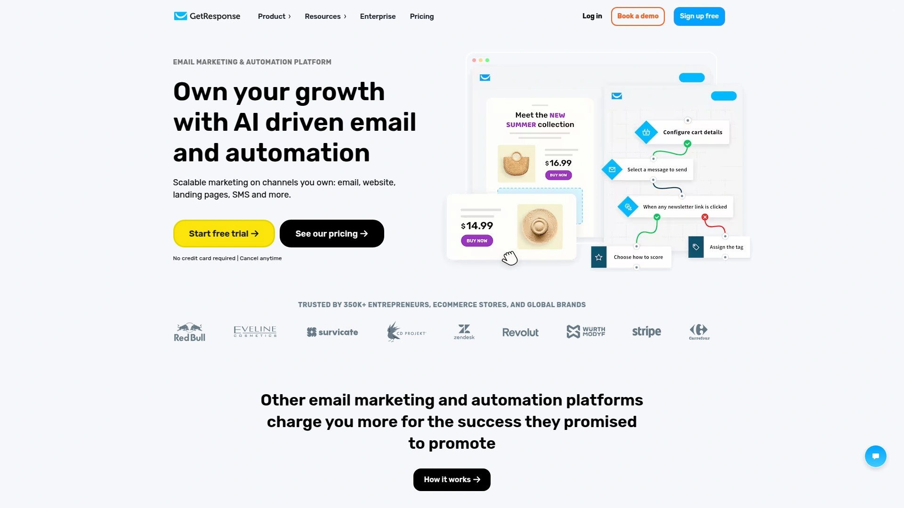

GetResponse bundles functionality competitors charge separately for, creating value through consolidation. Webinar hosting particularly differentiates it from pure email platforms.

Email marketing features include drag-and-drop editor with 500+ templates. Responsive designs adapt to devices automatically. Perfect timing AI optimizes send times per recipient. Unlimited emails on all paid plans.

**Automation builder** creates visual workflows with branching logic. Pre-built templates for common scenarios accelerate setup. Tagging and scoring qualify leads automatically. Conditional content personalizes messages.

Webinar platform hosts up to 1,000 attendees. Registration pages capture signups. Automated webinars replay recordings on schedules. This integration supports course creators and coaches.

Landing page builder generates conversion-optimized pages without coding. A/B testing compares variations. Pop-ups and forms grow lists. Website builder creates simple sites.

Ecommerce features include abandoned cart recovery, product recommendations, and transactional emails. Shopify, WooCommerce, and Magento integrations.

Free plan includes 500 contacts and 2,500 monthly emails. Email Marketing plan starts $15 monthly. Marketing Automation adds workflows at $49 monthly. Deliverability competitive with premium services.

Best for businesses wanting email plus webinars in one platform.

## [AWeber](https://www.aweber.com)

A veteran email marketing service emphasizing deliverability, customer support, and extensive template library for traditional email campaigns.

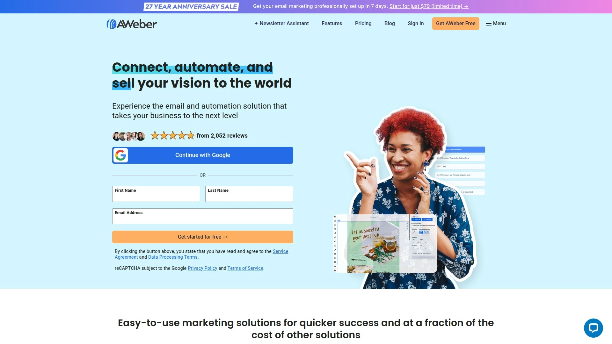

AWeber built reputation over 25 years focusing on reliability and support. The platform emphasizes fundamentals—delivering emails to inboxes and helping users succeed.

**Email templates** exceed 700 professionally designed options. Industry-specific designs provide relevant starting points. Drag-and-drop editor customizes without coding. Smart designer creates branded templates automatically.

Automation handles welcome series, abandoned carts, and basic sequences. Tag-based automation segments and personalizes. Behavioral triggers respond to subscriber actions. However, automation depth trails ActiveCampaign and HubSpot.

Landing page builder generates lead capture pages quickly. Forms embed across digital properties. Analytics track performance.

Customer support shines with phone, chat, and email assistance. Extensive knowledge base and live training webinars help users master features. This support particularly benefits less technical users.

Free plan covers 500 subscribers with basic features. Lite plan starts $12.50 monthly. Plus plan at $20 monthly adds automation. Pro at $899 monthly suits high-volume senders.

Deliverability rates strong across inbox providers. Integration marketplace connects hundreds of tools. Best for users prioritizing support and reliability over cutting-edge automation.

## [Omnisend](https://www.omnisend.com)

An ecommerce-focused automation platform integrating email, SMS, push notifications, and messaging for online stores.

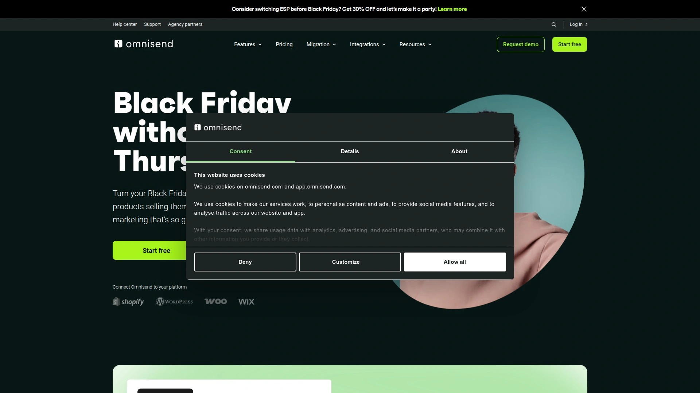

Omnisend specializes exclusively in ecommerce, tailoring every feature to online retail needs. Pre-built automation workflows reflect common shopping behaviors.

**Ecommerce automation** includes cart abandonment, browse abandonment, welcome series, post-purchase sequences, and customer win-back campaigns. Product recommendation engine suggests items based on browsing and purchase history. Birthday and anniversary messages drive repeat purchases.

Multi-channel campaigns combine email, SMS, and push notifications in single workflows. Contacts receive messages through preferred channels. Unified reporting shows cross-channel performance.

Email builder includes product picker pulling items directly from store catalogs. Discount code generation creates unique codes per recipient. Dynamic content shows different products to different segments.

Native integrations with Shopify, WooCommerce, BigCommerce, and Magento sync product data and customer information automatically. Sales attribution tracks which campaigns drive revenue.

Free plan includes 500 contacts and 500 emails monthly. Standard at $16 monthly adds automation and SMS credits. Pro plan includes advanced segmentation and reporting.

Best for ecommerce businesses wanting specialized features over general email marketing.

## [Klaviyo](https://www.klaviyo.com)

A data-driven ecommerce marketing platform offering sophisticated segmentation, predictive analytics, and real-time syncing with online stores.

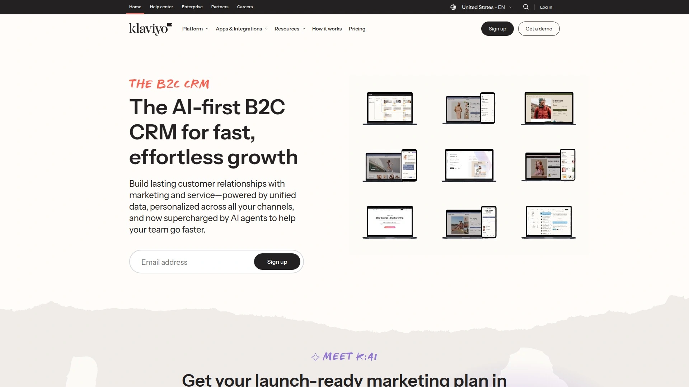

Klaviyo dominates ecommerce email marketing through unmatched data capabilities. The platform processes behavioral data in real-time, enabling hyper-targeted campaigns.

**Predictive analytics** forecast customer lifetime value, churn risk, and next purchase date. Machine learning identifies high-value segments. Smart sending optimizes delivery times per individual.

Segmentation reaches sophistication competitors can't match. Filter by detailed purchase history, browsing behavior, email engagement, predicted metrics, and custom properties. Dynamic segments update automatically as behaviors change.

Flow builder creates complex automation responding to dozens of triggers. Conditional splits personalize paths. Wait steps optimize timing. Product recommendations pull from catalog dynamically.

Email and SMS work together in unified campaigns. Forms and pop-ups capture leads with advanced targeting. Landing pages convert traffic.

Deep integrations with Shopify, WooCommerce, Magento, and BigCommerce sync every datapoint. Facebook and Instagram ad integration retargets based on email behaviors.

Free plan includes 250 contacts and 500 monthly email sends. Paid plans start $20 monthly for 251-500 contacts. Pricing scales aggressively with list size and sends. Best for established stores prioritizing data-driven marketing.

## [Drip](https://www.drip.com)

An ecommerce CRM combining email marketing, SMS, and customer data platform specifically for online retailers.

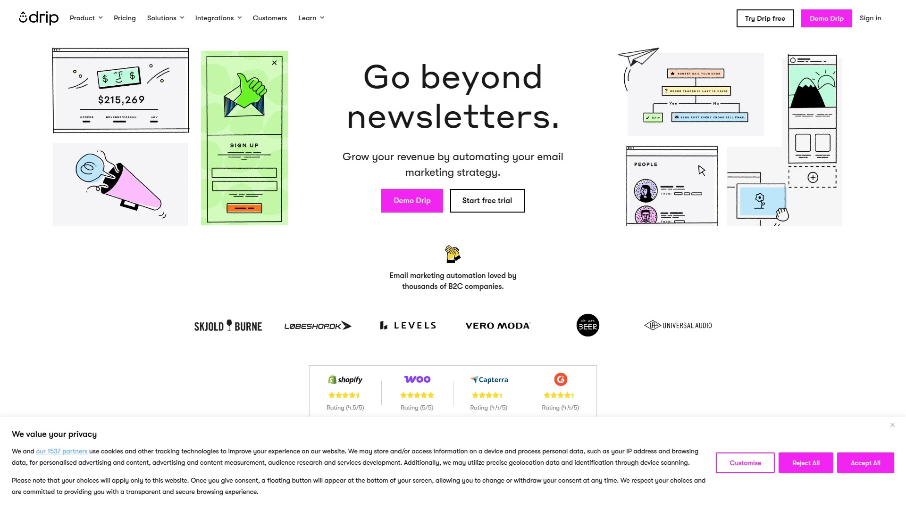

Drip positions as ecommerce CRM rather than simple email tool. Customer data platform unifies behavioral, transactional, and demographic information.

**Visual workflow builder** creates sophisticated automation with unlimited actions and conditions. Pre-built playbooks provide ecommerce-specific templates. Behavioral triggers respond to shopping actions.

Segmentation uses detailed ecommerce data including purchase frequency, average order value, product categories, and lifecycle stage. Personalization engine displays tailored content per recipient.

Email builder provides drag-and-drop simplicity with product blocks pulling from catalog. Dynamic content adapts messaging. Revenue attribution tracks which campaigns drive sales.

Multi-channel campaigns coordinate email and SMS delivery. Facebook Custom Audiences sync for retargeting. Instagram Shopping integration.

Native connections to Shopify, WooCommerce, and Magento. Webhooks enable custom integrations.

Pricing starts $39 monthly for 2,500 contacts. No free plan. Higher cost justified by ecommerce-specific features. Best for online stores outgrowing basic email tools.

## [Moosend](https://www.moosend.com)

An affordable automation platform offering sophisticated workflows, landing pages, and reporting at budget-friendly prices.

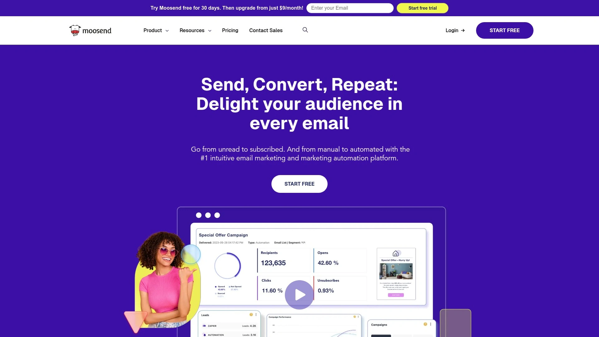

Moosend delivers premium features at entry-level prices. The platform targets small businesses wanting automation without enterprise budgets.

Email editor provides drag-and-drop creation with responsive templates. AI-powered subject line optimizer suggests improvements. Real-time content editor shows changes instantly.

**Automation recipes** include pre-built workflows for common scenarios. Custom recipe builder creates unlimited automations. Conditional logic branches paths based on behavior. Website tracking triggers actions based on visitor activity.

Landing page builder generates conversion-focused pages. A/B testing compares variations. Forms and pop-ups capture leads.

Subscription forms include GDPR-compliant double opt-in. List management tools clean and segment contacts. Reporting dashboards visualize performance.

Free 30-day trial tests full functionality. Pro plan starts $7 monthly for 500 subscribers. Enterprise adds dedicated support and custom features.

Integration marketplace connects major platforms. API enables custom connections. Best value for budget-conscious businesses wanting automation.

## [Constant Contact](https://www.constantcontact.com)

A user-friendly email marketing service emphasizing customer support, event marketing, and social media tools for small businesses.

Constant Contact targets small business owners without marketing expertise. Simplified interface and extensive support lower barriers to entry.

Email templates exceed 100 professional designs. Template editor customizes layouts without coding. Mobile-optimized emails display correctly on devices.

Basic automation includes welcome emails, birthday messages, and resend to non-openers. Automation capabilities trail specialized platforms but cover fundamentals.

**Event marketing features** set Constant Contact apart. Event registration pages capture attendees. Ticketing and payment processing built-in. Automated event reminders and follow-ups.

Social media tools schedule posts and track engagement. Facebook and Instagram ad creation. Website builder creates simple sites.

Customer support includes live chat, phone, and email plus community events. Knowledge base and how-to videos. Onboarding specialists help new users.

Free trial tests features for 14 days. Lite plan starts $12 monthly. Core adds automation and segmentation. Plus includes social media and event tools.

Best for small businesses prioritizing support and event management.

## [Campaigner](https://www.campaigner.com)

An advanced automation platform offering sophisticated workflows, multi-channel campaigns, and enterprise features for mid-market businesses.

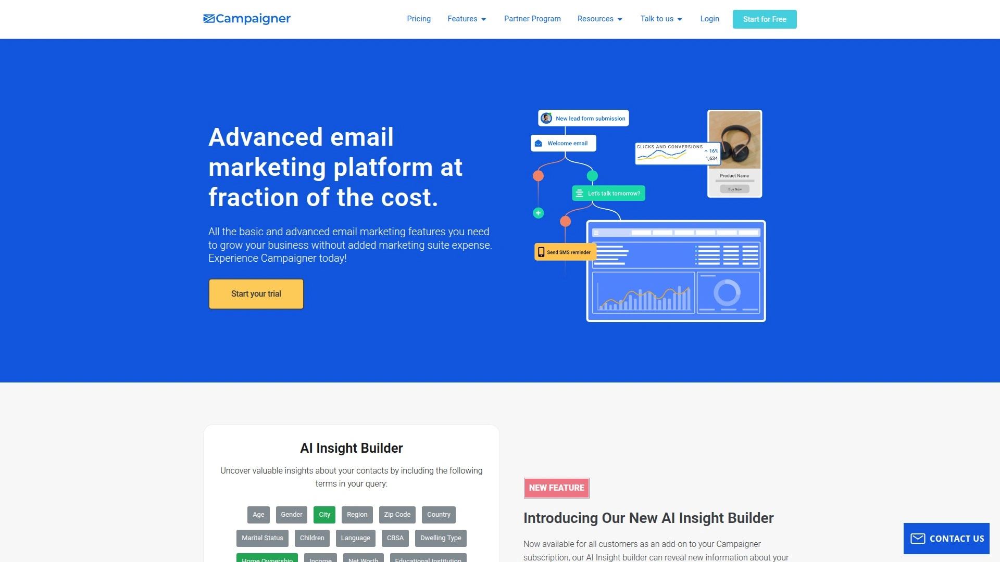

Campaigner targets companies outgrowing basic platforms but not yet needing enterprise solutions.

**Automation builder** creates multi-step workflows with complex logic. Geo-targeting triggers actions based on location. Behavioral automation responds to website visits and email engagement.

Email editor provides drag-and-drop and HTML options. Dynamic content personalizes sections per recipient. A/B testing optimizes elements.

SMS marketing integrates with email campaigns. Multi-channel workflows coordinate messaging. Social media integration.

Reporting includes advanced analytics and custom reports. Revenue tracking ties campaigns to sales. Engagement scoring identifies active contacts.

CRM integration syncs with Salesforce and other platforms. API enables custom connections. Dedicated IP addresses available.

Free 30-day trial. Pricing starts $59 monthly. Reputation system and certification workflow. Best for growing businesses needing advanced features.

## [Benchmark Email](https://www.benchmarkemail.com)

A straightforward email marketing platform offering clean interface, responsive templates, and polling features at competitive prices.

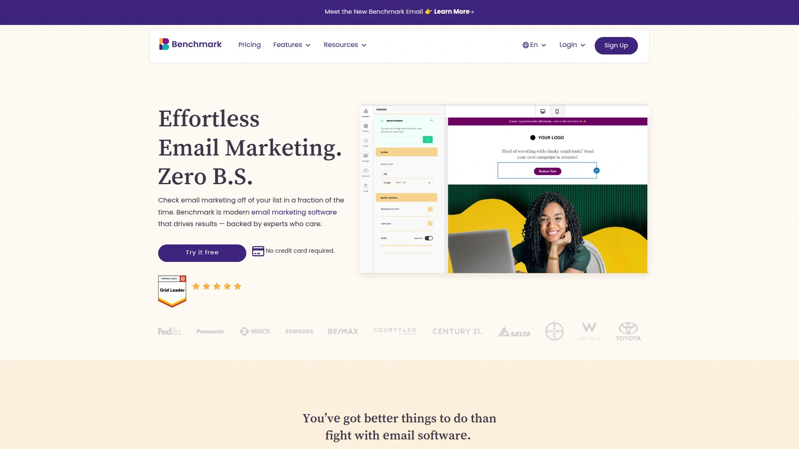

Benchmark Email emphasizes simplicity and ease of use. The platform provides essential email marketing without overwhelming options.

Drag-and-drop editor creates emails quickly. Responsive templates ensure mobile compatibility. Image editor built into platform.

Basic automation includes autoresponders and drip campaigns. Welcome series and date-based triggers. Automation capabilities basic compared to sophisticated platforms.

**Email polling feature** gathers feedback directly in messages. Surveys and polls engage subscribers. Reporting shows poll results.

List management tools segment and organize contacts. Signup forms capture leads. Inbox preview shows email across clients.

Free plan includes 500 subscribers and 3,500 monthly emails. Pro plan starts $13 monthly. Unlimited email sends.

Integration options connect common tools. Best for users wanting simple, affordable email marketing.

## [SendGrid](https://sendgrid.com)

A transactional email service excelling at triggered messages, API delivery, and high-volume sending with marketing features added.

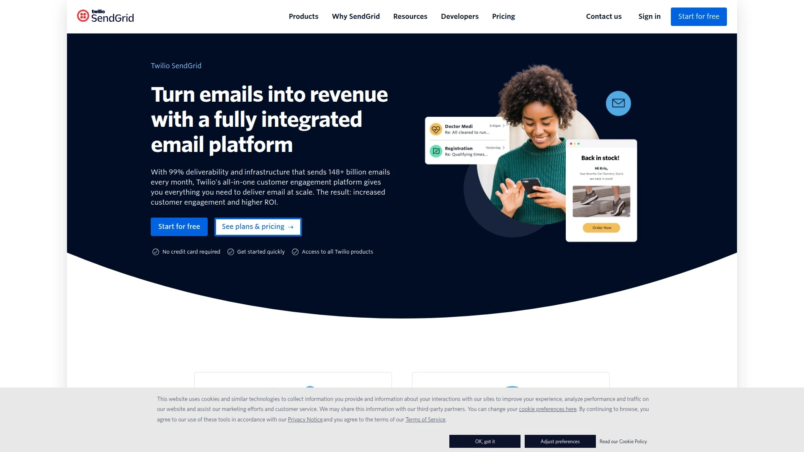

SendGrid specializes in transactional emails—order confirmations, password resets, shipping notifications—requiring reliable delivery. The platform expanded into marketing but maintains infrastructure focus.

**API integration** enables developers to send emails programmatically. RESTful API with comprehensive documentation. Official SDKs for major programming languages. SMTP relay supports legacy systems.

Email infrastructure includes dedicated IPs, domain authentication, and deliverability analytics. Spam testing previews inbox placement. Bounce and complaint handling automatic.

Marketing campaigns feature drag-and-drop editor with templates. Basic automation handles drip sequences. Segmentation targets audiences.

Deliverability experts monitor reputation and provide guidance. Compliance tools ensure CAN-SPAM and GDPR adherence.

Free plan sends 100 emails daily. Essentials starts $19.95 monthly for 50,000 emails. Pro adds dedicated IP and advanced features.

Best for businesses needing reliable transactional email with optional marketing.

## [Mailgun](https://www.mailgun.com)

A developer-focused email API prioritizing transactional delivery, detailed analytics, and programmable sending for technical teams.

Mailgun targets developers building applications requiring email functionality. The platform emphasizes APIs over visual interfaces.

**Email API** provides robust programmatic sending. Detailed documentation and code examples. Webhooks notify applications of email events. Rate limits accommodate high volume.

Deliverability features include domain validation, IP warming, and inbox placement testing. Real-time analytics track every message. Event logs enable debugging.

Email validation API verifies addresses before sending. This reduces bounces and protects reputation. Bulk verification processes entire lists.

Template management stores and versions email designs. Variables personalize content. Inbound email routing processes incoming messages.

Free tier includes 5,000 monthly emails. Foundation starts $35 monthly for 50,000 emails. Growth adds dedicated IPs.

Limited marketing automation features. Best for technical teams building email into applications.

## [Mailjet](https://www.mailjet.com)

A collaborative email platform offering real-time co-editing, transactional and marketing emails, and SMS in one solution.

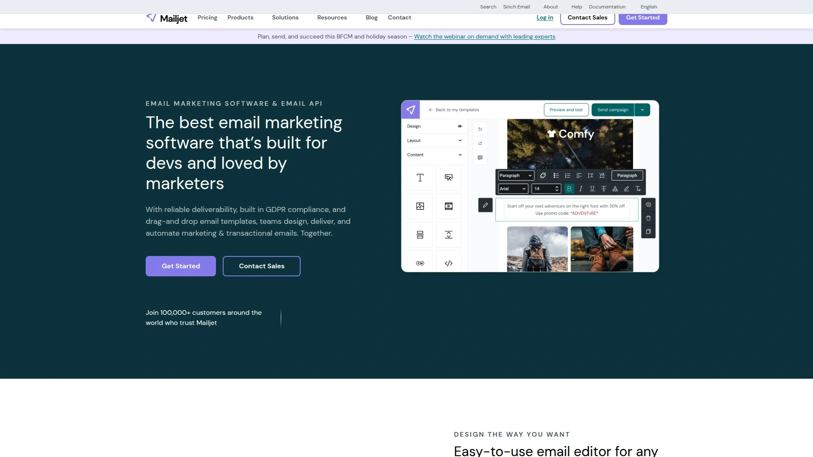

Mailjet differentiates through real-time collaboration features enabling teams to create emails together. Multiple users edit simultaneously like Google Docs.

**Email builder** includes drag-and-drop and HTML editors. Template library provides starting designs. Collaboration tools let teams comment and approve.

Marketing automation creates workflows with triggers and conditions. Segmentation targets audiences. A/B testing optimizes campaigns.

Transactional email API delivers confirmations, notifications, and alerts reliably. SMTP relay available. Real-time analytics track deliverability.

SMS marketing adds text messaging to campaigns. Multi-channel workflows coordinate email and SMS.

Free plan includes 6,000 monthly emails with 200 daily sends. Essential starts $15 monthly. Premium adds advanced features.

Extensive integrations connect business tools. Best for teams collaborating on email creation.

## [Keap (Infusionsoft)](https://keap.com)

An all-in-one CRM, sales, and marketing automation platform designed for small businesses managing complex customer lifecycles.

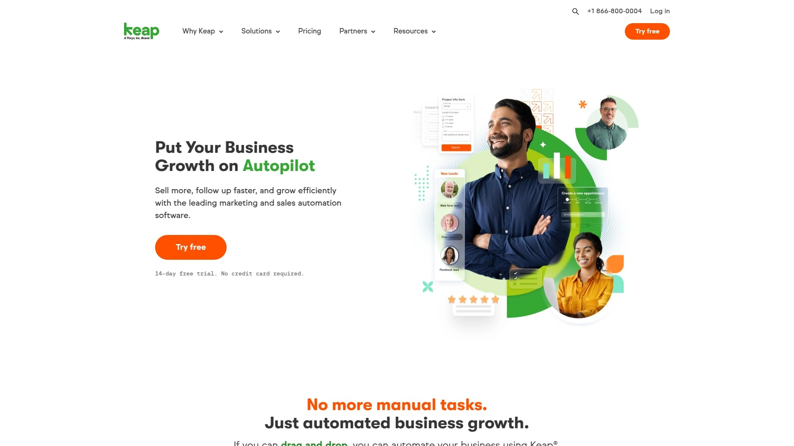

Keap combines CRM, email marketing, sales pipeline, and payment processing into unified platform. This consolidation suits service-based businesses managing many moving parts.

**Pipeline management** visualizes sales processes with drag-and-drop deal stages. Task automation assigns follow-ups automatically. Lead scoring identifies hot prospects.

Marketing automation creates sophisticated workflows. Tagging system tracks customer journey. Conditional logic branches paths based on behavior.

Email builder provides templates and customization. Landing pages capture leads. Appointment scheduling books meetings.

Payment processing accepts credit cards and ACH. Invoicing and billing automation. Quote generation.

Single pricing tier at $299 monthly includes all features. No cheaper options. Pricing includes 1,500 contacts.

Complexity requires time investment to master. Dedicated onboarding helps. Best for service businesses wanting unified operations platform.

## [Sendinblue](https://www.sendinblue.com)

Now rebranded as Brevo, this multi-channel platform historically offered email, SMS, and chat with contact-unlimited pricing.

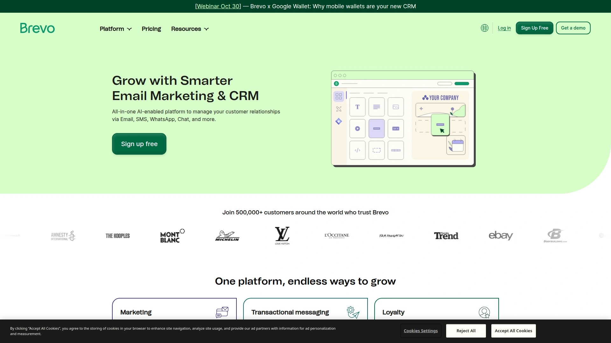

Note: Sendinblue rebranded to Brevo in 2022 while maintaining core functionality. See Brevo section for current details.

The platform's contact-unlimited model charges based on emails sent rather than list size. This benefits businesses with large, infrequently-contacted lists.

Email, SMS, WhatsApp, and live chat work together in unified interface. Marketing automation creates workflows across channels. CRM manages contacts and deals.

Transactional email API sends triggered messages reliably. SMTP relay available. Dedicated IPs optional.

Free plan includes unlimited contacts with 300 daily emails. Lite starts $25 monthly for 20,000 emails. Premium adds advanced automation.

Best for businesses with large lists sending infrequently.

## [Sendlane](https://www.sendlane.com)

An ecommerce email and SMS platform offering real-time behavioral tracking, predictive analytics, and unified automation.

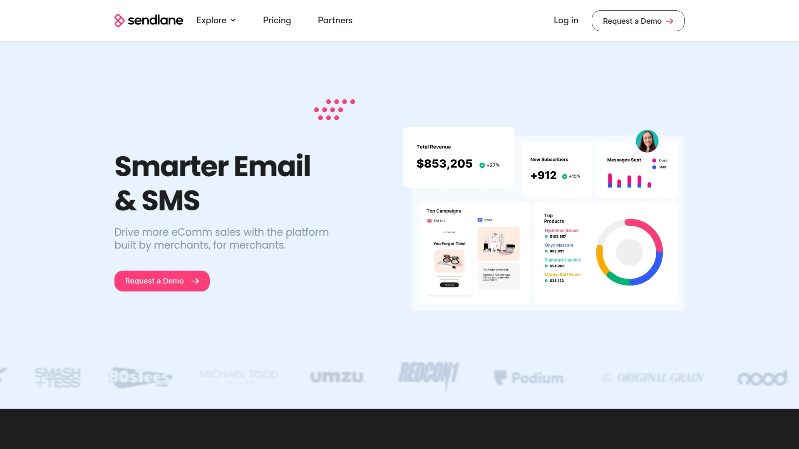

Sendlane targets ecommerce brands wanting sophisticated automation. Real-time data processing enables immediate behavioral responses.

Unified customer data platform tracks behaviors across channels. Behavioral automation triggers messages based on actions. Predictive analytics forecast customer value.

Email and SMS work together in multi-channel campaigns. Pop-ups and forms capture leads. Product recommendations personalize content.

Deep integrations with Shopify, WooCommerce, and BigCommerce. Facebook Custom Audiences sync. Detailed reporting tracks revenue.

Pricing requires custom quotes. Positioned as premium ecommerce solution. Best for established online stores.

## [Encharge](https://encharge.io)

A marketing automation platform specializing in behavior-based email sequences for SaaS companies and digital products.

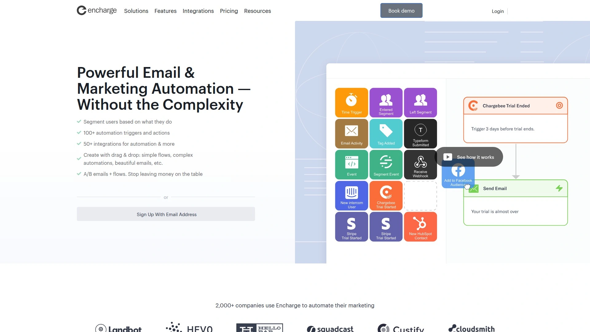

Encharge focuses specifically on SaaS onboarding, activation, and retention. The platform understands product-led growth models.

**Behavior-based automation** triggers emails based on product usage. Feature adoption sequences guide users. Churn prevention campaigns engage at-risk customers.

Flow builder creates visual workflows with product triggers. User segmentation based on behavior and properties. A/B testing optimizes sequences.

Integrations with product analytics tools like Segment, Mixpanel, and Amplitude. CRM connections sync customer data.

Pricing starts around $49 monthly. Scales with contacts. Best for SaaS companies automating user journeys.

## [beehiiv](https://www.beehiiv.com)

A newsletter platform combining publishing, growth tools, and monetization features specifically for content creators and publishers.

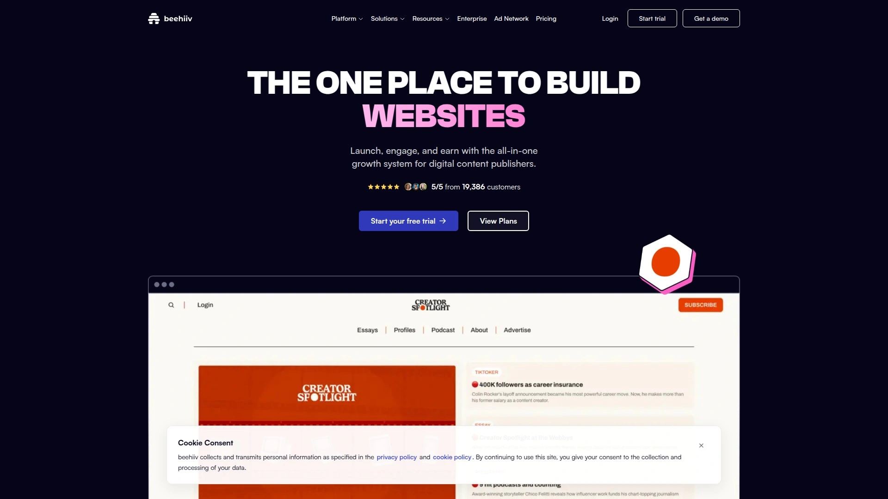

beehiiv targets newsletter creators wanting integrated publishing and monetization. The platform emphasizes growth and revenue.

Newsletter editor optimizes for reading experience. Customizable layouts maintain brand. Import from Substack and other platforms.

**Growth tools** include referral programs, recommendations, and boosts. Audience segmentation targets content. Analytics track subscriber behavior.

Monetization through paid subscriptions, ads, and premium content. Payment processing built-in. Revenue sharing optional.

Free plan includes unlimited subscribers. Scale plan starts $43 monthly. Max adds advanced features.

Best for newsletter creators prioritizing growth and revenue.

## [Autopilot](https://www.autopilothq.com)

A visual marketing automation platform offering customer journey mapping, multi-channel messaging, and integration hub.

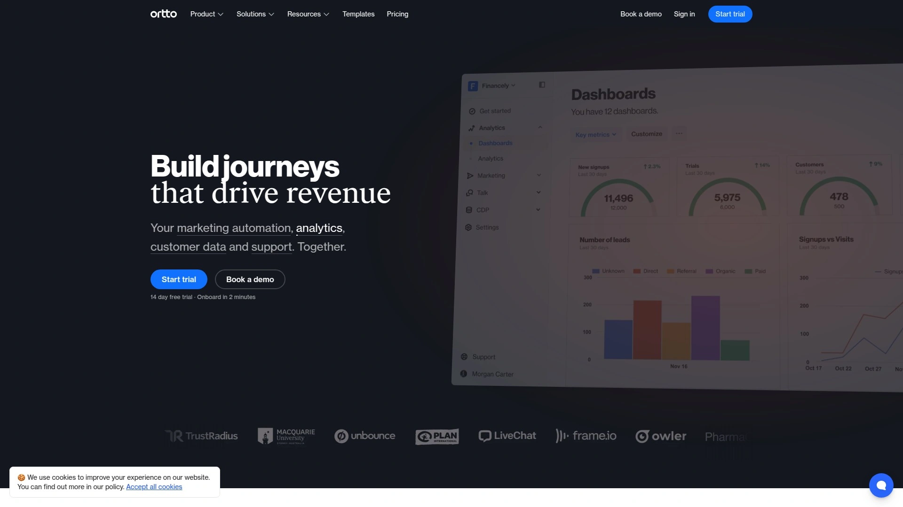

Autopilot emphasizes visual journey mapping showing customer paths clearly. Canvas-based interface makes automation intuitive.

Email, SMS, and in-app messages work together. Behavioral triggers respond to actions. Conditional logic personalizes paths.

Integration with CRMs, analytics platforms, and business tools. Zapier expands connections. API enables custom integrations.

Best for businesses wanting visual automation builder. Pricing requires contact.

## [Ortto (Autopilot)](https://ortto.com)

The rebranded version of Autopilot, now Ortto, offering expanded CDP and analytics capabilities.

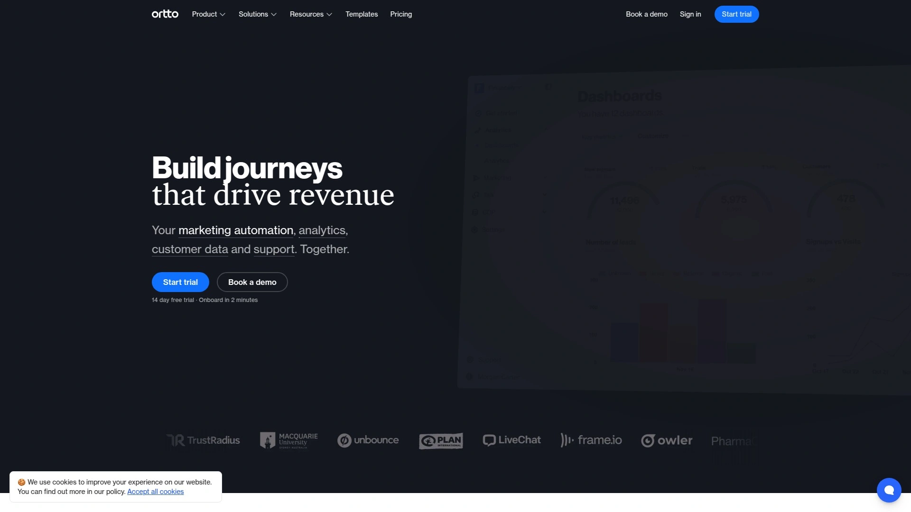

Note: Autopilot rebranded to Ortto with enhanced customer data platform features.

Unified customer profiles combine data from all sources. Behavioral tracking across touchpoints. Predictive scoring identifies opportunities.

Email, SMS, push notifications, and in-app messages in unified workflows. Visual journey builder maps customer paths. Real-time personalization.

Analytics and reporting track full customer lifecycle. Attribution modeling shows channel impact. Custom dashboards.

Pricing based on contacts and features. Best for companies needing CDP with automation.

## [Customer.io](https://customer.io)

A messaging platform enabling developers to send triggered emails, push notifications, and SMS based on real-time behavioral data.

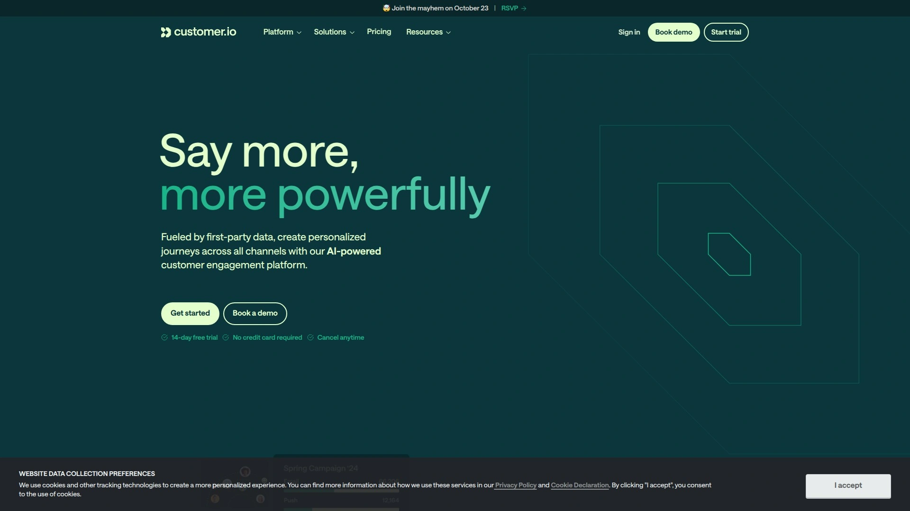

Customer.io targets technical teams building automated messaging into products. API-first approach suits developers.

Event-based messaging triggers communications based on product usage. Behavioral segmentation groups users dynamically. Liquid templating personalizes content.

Email, push notifications, SMS, and webhooks in unified platform. Multi-channel campaigns coordinate messaging. A/B testing optimizes campaigns.

Data warehouse integration syncs customer data. Segment and mParticle connections. Custom integrations via API.

Pricing scales with contacts and messages. Best for product teams automating user communication.

## [EmailOctopus](https://emailoctopus.com)

An affordable email marketing service built on Amazon SES offering simple campaigns and automation at low cost.

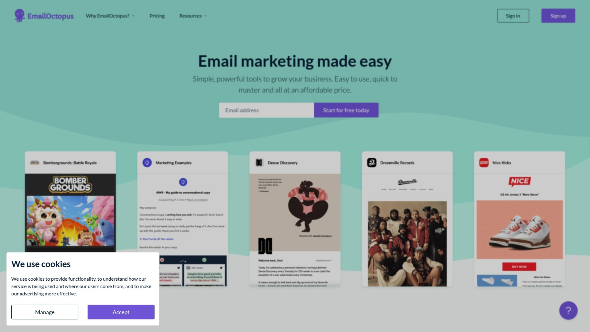

EmailOctopus provides essential email marketing at budget prices by using Amazon SES infrastructure. This reduces costs significantly.

Email editor creates campaigns with templates and customization. Landing pages capture leads. Forms embed across sites.

Basic automation includes drip campaigns and triggered emails. Segmentation targets audiences. Reporting tracks performance.

Free plan includes 2,500 subscribers and 10,000 monthly emails. Pro starts $8 monthly. Unlimited emails.

Limited features compared to full-service platforms. Best for price-conscious users needing basics.

## [Sender](https://www.sender.net)

A budget-friendly email and SMS platform offering automation, segmentation, and pop-ups with generous free tier.

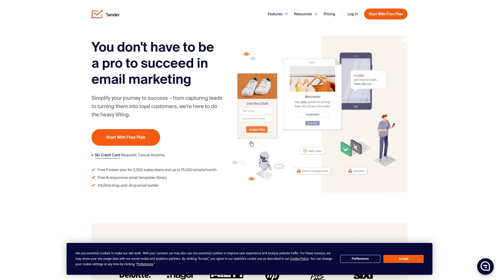

Sender provides solid functionality at minimal cost. Free plan genuinely useful for small operations.

Drag-and-drop email builder with responsive templates. SMS campaigns add text messaging. Push notifications engage visitors.

Automation workflows trigger based on behavior. Segmentation targets messages. Pop-ups and forms grow lists.

Free plan includes 2,500 subscribers and 15,000 monthly emails. Standard starts $8.33 monthly. Professional adds advanced features.

Ecommerce integrations connect online stores. Best for bootstrapped businesses.

***

### How much should I budget monthly for email marketing platforms?

Budget $15-50 monthly for small businesses under 1,000 contacts using basic automation, $50-150 for growing businesses with 1,000-10,000 contacts needing sophisticated workflows, and $150-500+ for established companies with larger lists or requiring CRM integration and advanced features. Contact count drives costs more than features across most platforms.

### Can I switch email platforms without losing subscribers or automation?

Most modern platforms provide migration tools and services transferring contact lists, templates, and even automation workflows from competitors. However, automation logic often requires rebuilding since platforms use different workflow structures. Export contacts as CSV files and map custom fields before switching. Budget 1-2 weeks for complete migration.

### Do these platforms actually improve deliverability compared to using my own email server?

Professional email platforms maintain dedicated infrastructure, IP reputation management, domain authentication, and relationships with inbox providers that dramatically improve deliverability over DIY solutions. Services like ActiveCampaign, Mailchimp, and SendGrid achieve 80-85% inbox placement rates versus 40-60% typical for self-hosted email. The investment pays for itself through higher open rates.

---

### Conclusion

Stop cobbling together five different tools just to send automated emails that actually reach inboxes. The right email marketing platform consolidates campaign creation, behavioral automation, CRM functionality, and deliverability management into one dashboard that grows with your business instead of forcing painful migrations every year. For businesses wanting the most sophisticated automation workflows combining email, CRM pipelines, machine learning, and sales engagement without enterprise complexity or Salesforce-level pricing, [ActiveCampaign](#activecampaign) delivers the sweet spot by providing powerful if/then logic, visual workflow builders, and behavior-triggered sequences that turn complex customer journeys into repeatable systems, making it especially suitable for consultative B2B companies, online course creators, and service businesses nurturing leads through multi-touch sales processes where generic broadcast emails fail.
